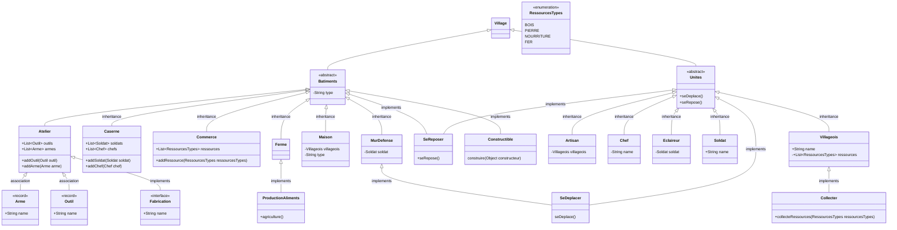

# brief09-mermaid-uml

```mermaid
---
titre: Nebula Game Labs
---

classDiagram
    Village <|-- Batiments
    Village <|-- Unites
    
    class Batiments {
        <<abstract>>
        -String type
    }
    
    Batiments <|-- Atelier
    class Atelier {
        +List~Outil~ outils
        +List~Arme~ armes
        +addOutil(Outil outil)
        +addArme(Arme arme)
    }
    
    Batiments <|-- Caserne : inheritance
    class Caserne {
        +List~Soldat~ soldats
        +List~Chef~ chefs
        +addSoldat(Soldat soldat)
        +addChef(Chef chef)
    }
    
    Batiments <|-- Commerce: inheritance
    Commerce : +List~RessourcesTypes~ ressources
    Commerce : +addRessource(RessourcesTypes ressourcesTypes)
    
    class RessourcesTypes {
        <<enumeration>>   
        BOIS
        PIERRE
        NOURRITURE
        FER
    }
    
    Batiments <|-- Ferme: inheritance
    Ferme <|-- ProductionAliments : implements
    ProductionAliments : +agriculture()
    
    Batiments <|-- Maison: inheritance
    class Maison {
        -Villageois villageois
        -String type
    }
    
    Batiments <|-- MurDefense: inheritance
    MurDefense : -Soldat soldat
    
    MurDefense <|-- SeDeplacer : implements
    SeDeplacer : seDeplace()
    
    Batiments <|-- SeReposer : implements
    SeReposer : +seRepose()
    
    Batiments <|-- Constructible : implements
    Constructible : construire(Object constructeur)
    
    Atelier <|-- Arme : association
    class Arme {
        <<record>>
        +String name
    }
    
    Atelier <|-- Outil : association
    class Outil {
        <<record>>
        +String name
    }
    
    Atelier <|-- Fabrication : implements
    class Fabrication {
        <<interface>>
        +String name
    }
 
    class Unites {
        <<abstract>>
        +seDeplace()
        +seRepose()
    }

    Unites <|-- SeDeplacer : implements
    Unites <|-- SeReposer : implements
    Unites <|-- Artisan: inheritance
    Artisan : -Villageois villageois

    Unites <|-- Chef: inheritance
    Chef : -String name

    Unites <|-- Eclaireur: inheritance
    Eclaireur : -Soldat soldat

    Unites <|-- Soldat: inheritance
    Soldat : +String name

    Unites <|-- Villageois: inheritance
    class Villageois {
        +String name
        -+List~RessourcesTypes~ ressources
    }
    Villageois <|-- Collecter : implements
    Collecter : +collecteRessources(RessourcesTypes ressourcesTypes)

```