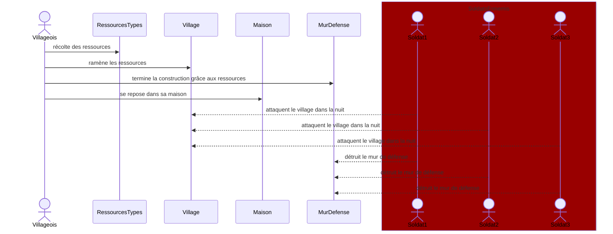

# brief09-mermaid-uml

```mermaid
---
titre: Nebula Game Labs
---

sequenceDiagram
    actor Villageois
    participant RessourcesTypes
    
    Villageois->>RessourcesTypes : récolte des ressources
    
    participant Village
    Villageois->>Village : ramène les ressources

    participant Maison
    participant MurDefense
    
    Villageois->>MurDefense : termine la construction grâce aux ressources
    Villageois->>Maison : se repose dans sa maison
    
    box rgb(153,0,0) SoldatsEnnemis
    actor Soldat1
    actor Soldat2
    actor Soldat3
    end
    Soldat1-->>Village : attaquent le village dans la nuit
    Soldat2-->>Village : attaquent le village dans la nuit
    Soldat3-->>Village : attaquent le village dans la nuit
    
    Soldat1-->>MurDefense : détruit le mur de défense
    Soldat2-->>MurDefense : détruit le mur de défense
    Soldat3-->>MurDefense : détruit le mur de défense

```