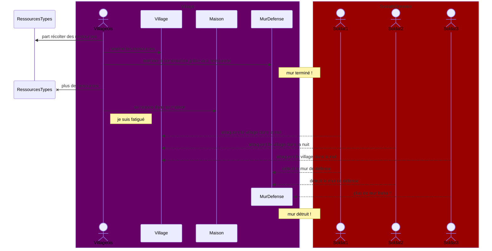

# brief09-mermaid-uml

```mermaid
---
titre: Nebula Game Labs
---

sequenceDiagram
    participant RessourcesTypes
    actor Villageois
    
    Villageois->>RessourcesTypes : part récolter des ressources
    
    box rgb(102,0,102) Village
        participant  Villageois
        participant Village
        participant Maison
        participant MurDefense
    end
    
    Villageois->>Village : ramène les ressources
    
    Villageois->>MurDefense : termine la construction grâce aux ressources
    note right of MurDefense : mur terminé !
    
    destroy RessourcesTypes
    Villageois-xRessourcesTypes : plus de ressources

    Villageois->>Maison : se repose dans sa maison
    note right of Villageois : je suis fatigué
    
    box rgb(153,0,0) SoldatsEnnemis
    actor Soldat1
    actor Soldat2
    actor Soldat3
    end
    Soldat1-->>Village : attaquent le village dans la nuit
    Soldat2-->>Village : attaquent le village dans la nuit
    Soldat3-->>Village : attaquent le village dans la nuit

    Soldat1-->>MurDefense : détruit le mur de défense
    Soldat2-->>MurDefense : détruit le mur de défense
    destroy MurDefense
    Soldat3-->>MurDefense : plus de mur haha !!
    note right of MurDefense : mur détruit !

    

```